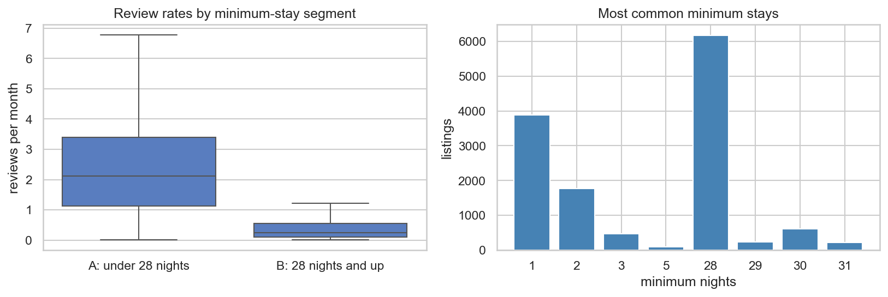

# Toronto Airbnb Review-Rate Modeling

## Project summary

Built an end-to-end regression workflow on **22,256 Toronto Airbnb listings** to
evaluate how well listing attributes and title text predict observed monthly review
activity. The pipeline combines row-level feature engineering, numeric and categorical
preprocessing, and title TF-IDF; it compares linear, tree, boosting, and stacking
models before tuning LightGBM.

The selected model achieves **R² 0.5312, RMSE 1.1768, and MAE 0.6951** on 3,445
test listings with recorded review rates. Review frequency is a proxy for booking
activity, not a direct measure of occupancy, revenue, or popularity.

**Stack:** Python, pandas, scikit-learn, LightGBM, XGBoost, CatBoost, and SHAP.

## Results

Final evaluation on the test set:

| Model                    |         R² |       RMSE |        MAE |
| ------------------------ | ---------: | ---------: | ---------: |
| Tuned LightGBM           | **0.5312** | **1.1768** | **0.6951** |
| Training-mean baseline   |    ≈0.0000 |     1.7186 |     1.2963 |
| Training-median baseline |    −0.1632 |     1.8535 |     1.1880 |

The tuned model reduces RMSE by **31.5%** relative to the mean baseline and MAE
by **41.5%** relative to the median baseline. The mean is the optimal constant
prediction for squared error; the median is the optimal constant for absolute error.
RMSE and MAE are measured in reviews per month.

## What I built

- **A mixed-data preprocessing pipeline.** I created ten row-level features and used
  `ColumnTransformer` to process numeric values, categories, and listing-title text.
  Each evaluation fold learned its own imputation values, scaling parameters,
  category levels, and TF-IDF vocabulary from the training rows only. Explicit
  review-history fields were excluded from the model inputs.
- **A fair comparison of missing-target policies.** I compared removing listings
  with missing review rates against treating those rates as zero. Both approaches
  were evaluated on the same validation listings with recorded targets. Removing
  the missing targets performed better for this task, so all later results apply
  only to listings with recorded review rates.
- **A benchmark across model families and compute costs.** I compared Ridge,
  Decision Tree, Random Forest, LightGBM, XGBoost, CatBoost, and stacking with the
  same five-fold evaluation design. Accuracy metrics, fitting time, and scoring time
  were reported together so that small accuracy gains could be weighed against
  additional computation.
- **Cost-aware model selection and tuning.** Stacking reached mean CV R² 0.5045 but
  took 96.9 seconds per fold in the recorded run. Untuned LightGBM reached 0.4965
  in 4.1 seconds, making it the fastest model in the near-best shortlist. A
  40-configuration randomized search then raised LightGBM's mean CV R² to 0.5067,
  but also increased its fit time to 115.5 seconds per fold.
- **Separate development diagnostics and final evaluation.** Model and parameter
  choices were made using the development data before the selected model was scored
  on the test set. Out-of-fold segment analysis, permutation importance, SHAP, and
  residual plots were used to examine where the fitted model succeeds and fails.

## Key findings

- **Minimum-stay group is important, but it does not explain the full result.** A
  simple model that predicts the training-fold mean for either under-28 or 28-plus
  listings reaches development out-of-fold R² 0.3501. Tuned LightGBM reaches 0.5064
  on the same rows, showing that the remaining listing information adds predictive
  value beyond this two-group division.
- **The model retains predictive value within both minimum-stay groups.** R² is
  0.2396 for under-28 listings and 0.2453 for 28-plus listings when each group is
  evaluated separately. Absolute errors are higher for under-28 listings, whose
  review rates are also higher and more variable.
- **Reducing the feature set did not improve validation accuracy.** Selecting 50
  transformed columns inside each fold produced mean R² 0.4947, compared with
  0.4965 when all columns were retained. The final pipeline therefore uses the full
  transformed representation.
- **Tuning produced a modest accuracy gain at a large training-cost increase.** Mean
  CV R² increased from 0.4965 to 0.5067, while recorded fit time rose from 4.1 to
  115.5 seconds per fold. Untuned LightGBM remains a practical lower-cost option.



## Limitations and next steps

- **What the target measures.** `reviews_per_month` measures how often reviews are
  recorded. It is influenced by booking turnover and whether guests leave reviews,
  so it should not be interpreted as occupancy, revenue, or overall popularity.
- **Who the results apply to.** Listings with missing review rates were excluded.
  The reported metrics therefore describe listings with recorded review rates, not
  all listings or listings waiting for their first review.
- **What the test split measures.** The test set contains new listing rows, but not
  always new hosts. Of the 3,445 test listings, 1,349 (39.2%) share a host with the
  training set. The result therefore does not establish performance for entirely
  new hosts. Because listing information can change over time, it also does not
  validate future-period or pre-publication predictions.
- **Uncertainty from model selection.** The same development folds were used to
  compare models and tune hyperparameters. The selected mean CV scores may therefore
  be optimistic and should not be treated as independent final estimates. The
  separate test set provides the final row-level evaluation.
- **Scope of the exploratory analyses.** Some initial feature-selection comparisons
  reused preprocessing fitted on all development rows, while permutation importance
  and SHAP used training samples. These analyses help explain the fitted model, but
  they do not provide independent performance estimates or causal evidence.
- **Stability of the errors.** Residual plots indicate underprediction at high review
  rates. Because the evaluation uses one random train-test split, it does not show
  whether the same error pattern will remain stable across time, hosts, or
  neighborhoods.

## Data and reproducibility

The data was supplied from [Inside Airbnb](https://insideairbnb.com/get-the-data/).
The exact source snapshot date and original download URL were not retained. The
local file checksum is incorporated into the experiment cache key.

Validated environment: **Python 3.13.9**. Exact package versions are listed in
[requirements.txt](requirements.txt).

```bash
python -m pip install -r requirements.txt
jupyter notebook toronto-airbnb-demand.ipynb
```

**[Open the full analysis →](toronto-airbnb-demand.ipynb)**
